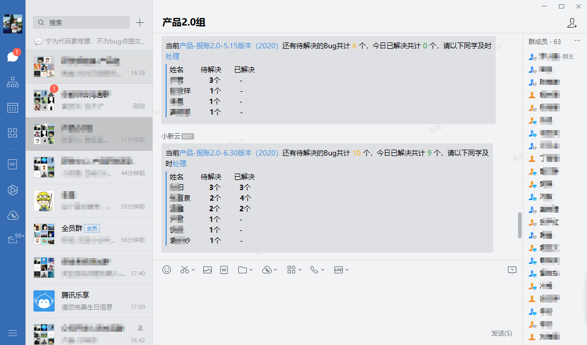
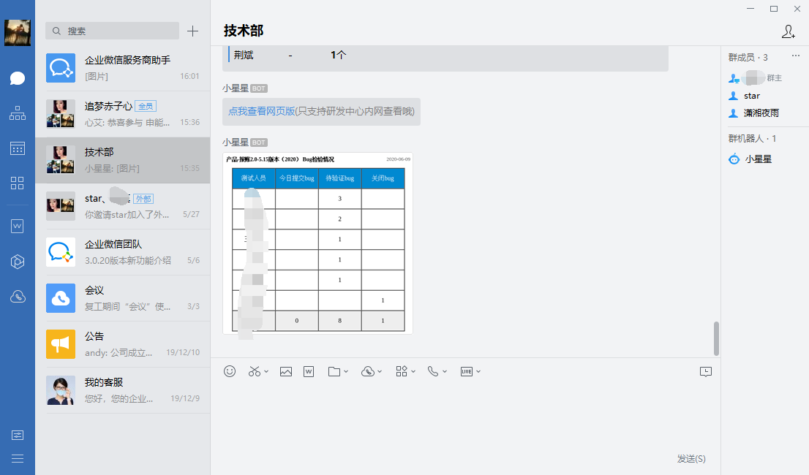
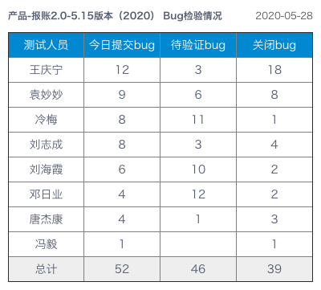

<!--
 * @Author: Do not edit
 * @Date: 2020-02-25 13:59:18
 * @LastEditors: 秦真
 * @LastEditTime: 2020-06-09 19:05:25
 * @Description: 
 * @FilePath: \qywx-robot\README.md
--> 
# 企业微信机器人

- 自动登录[禅道](https://www.zentao.net/)
  > 事实上新版禅道已经支持集成 企业微信，钉钉 等消息推送。咱公司禅道使用的版本是9.8.3版本。
- 统计禅道指定项目bug，获取开发人员bug数，当天解决bug数
- 通过[企业微信群聊机器人](https://work.weixin.qq.com/api/doc/90000/90136/91770)，将统计到的数据发送到群

  

  

  